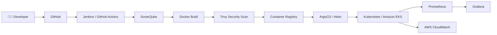

<div align="center">

# 👋 Hi, I'm Akash Pedraj

### 🚀 DevOps Engineer | AWS Cloud | Kubernetes | Terraform | CI/CD | Docker

<p>
  <a href="mailto:akashpedraj121@gmail.com">
    
  </a>
  <a href="https://github.com/AkashPedraj">
    
  </a>
</p>


</div>

---

## 👨‍💻 About Me

I'm a **DevOps Engineer with 3+ years of experience** working on cloud infrastructure, CI/CD automation, containerization, Kubernetes, Infrastructure as Code, monitoring, and DevSecOps.

I enjoy building reliable and automated systems that reduce manual effort and make application deployments **faster, safer, and more repeatable**.

Currently working with:

* ☁️ **AWS Cloud**
* ☸️ **Kubernetes / Amazon EKS**
* 🐳 **Docker**
* 🔄 **Jenkins / GitHub Actions**
* 🌱 **ArgoCD / GitOps**
* 🏗️ **Terraform / Ansible**
* 📦 **Helm**
* 📊 **Prometheus / Grafana**
* 🔐 **DevSecOps / Security Automation**

> 💡 My focus: **Automate → Deploy → Monitor → Secure → Improve**

---

## 🧑‍💼 Professional Experience

### DevOps Engineer — Infosys

**April 2023 – Present**

My professional experience includes:

* Designing and maintaining automated **CI/CD pipelines**
* Managing cloud infrastructure on **AWS**
* Provisioning infrastructure using **Terraform**
* Managing containerized workloads on **Amazon EKS**
* Implementing **GitOps workflows using ArgoCD**
* Building Kubernetes deployments using **Helm**
* Implementing monitoring with **Prometheus, Grafana and CloudWatch**
* Integrating security tools such as **SonarQube and Trivy**
* Implementing AWS **IAM least-privilege** practices
* Using **AWS Secrets Manager** for secure application deployments
* Troubleshooting application, infrastructure and deployment issues
* Working with development, QA and operations teams in Agile/Scrum environments

---

# 🛠️ DevOps Tech Stack

<div align="center">

### ☁️ Cloud

<a href="https://aws.amazon.com/">

</a>

### ☸️ Containers & Orchestration


### 🔄 CI/CD & GitOps


### 🏗️ Infrastructure as Code


### 📊 Monitoring & Observability


### 🐧 Operating Systems & Scripting


### 🔧 Development & Configuration


</div>

---

# 🚀 DevOps Engineering Workflow

<div align="center">



</div>

### 🔁 Typical Deployment Flow

**Code → Git → CI Pipeline → Code Quality → Security Scan → Docker Image → Registry → GitOps → Kubernetes → Monitoring**

---

# 📂 Featured Projects

## 🏦 Global Banking Infrastructure Automation Platform

**AWS | Terraform | Jenkins | Docker | Kubernetes | EKS | Helm | ArgoCD | Prometheus | Grafana**

Designed an automated cloud-native infrastructure and deployment platform.

### What I implemented

* 🏗️ Reusable **Terraform modules** for AWS infrastructure
* 🔄 End-to-end **Jenkins CI/CD pipelines**
* 🐳 Dockerized microservices
* ☸️ Kubernetes workloads on **Amazon EKS**
* ⛵ Helm-based application deployments
* 🌱 GitOps deployment using **ArgoCD**
* 📊 Prometheus and Grafana monitoring
* ☁️ AWS CloudWatch observability

---

## 🏥 Healthcare Application CI/CD & Monitoring

**Jenkins | Terraform | Ansible | Kubernetes | Helm | SonarQube | Trivy | Prometheus | Grafana**

Built an automated CI/CD and monitoring solution for containerized applications.

### Highlights

* 🔄 Automated application build and deployment using Jenkins
* 🏗️ Infrastructure provisioning using Terraform
* ⚙️ Server configuration using Ansible
* ☸️ Kubernetes workload management
* ⛵ Helm-based deployments
* 🔍 SonarQube code-quality analysis
* 🛡️ Trivy container security scanning
* 📊 Prometheus + Grafana monitoring
* 🚨 Proactive alerting and infrastructure visibility

---

## 🌐 Apache Website — Full DevOps CI/CD Pipeline

**AWS EC2 | Jenkins | Ansible | Docker | Kubernetes | GitHub**

🔗 **Repository:**
https://github.com/AkashPedraj/apachewebsite

### Pipeline

```text
GitHub
   ↓
Jenkins
   ↓
Ansible
   ↓
Docker
   ↓
Docker Hub
   ↓
Kubernetes
   ↓
Live Website
```

### Highlights

* Built Kubernetes cluster using **kubeadm**
* Configured Ansible SSH key-based authentication
* Automated Docker image build and push
* Created Jenkins CI/CD pipeline
* Deployed application using Kubernetes
* Configured multiple application replicas
* Exposed application using Kubernetes NodePort

---

## 🍔 Cloud-Native Food Delivery Platform — Zomato Clone

**AWS EKS | Docker | Jenkins | Prometheus | Grafana**

🔗 **Repository:**
https://github.com/AkashPedraj/FoodAppZomato-DevOps

### Highlights

* 🐳 Containerized application components
* ☸️ Deployed workloads on **AWS EKS**
* 🔄 Implemented CI/CD automation
* 📈 Configured Kubernetes autoscaling
* 📊 Integrated Prometheus monitoring
* 📉 Built Grafana dashboards
* 🚀 Improved deployment efficiency through automation

---

## 🎫 Online Ticketing Platform — DevOps Automation

**AWS EKS | Jenkins | Terraform | Ansible**

🔗 **Repository:**
https://github.com/AkashPedraj/OnlineTicketPlatform-MyDeployment

### Highlights

* 🔄 Jenkins CI/CD automation
* 🏗️ Terraform infrastructure provisioning
* ⚙️ Ansible configuration management
* ☸️ Kubernetes deployment on AWS EKS
* 📦 Automated application deployment workflows

---

## ☁️ AWS 3-Tier Web Application

**AWS EC2 | VPC | RDS | Route 53 | IAM**

🔗 **Repository:**
https://github.com/AkashPedraj/AWS3TierApp-MyDeployment

### Highlights

* Designed secure AWS VPC architecture
* Created public and private subnets
* Deployed EC2 application infrastructure
* Integrated Amazon RDS
* Configured Route 53
* Implemented IAM least-privilege access

---

# 📊 GitHub Statistics

<div align="center">


</div>

---

# 🔥 GitHub Contribution Activity

<div align="center">


</div>

---

# 🐍 Contribution Graph

<div align="center">


</div>

---

# 🏆 Key Achievements

| Achievement         | Impact                                                 |
| ------------------- | ------------------------------------------------------ |
| 🚀 CI/CD Automation | Reduced deployment effort through automated pipelines  |
| ☸️ Kubernetes       | Managed containerized workloads on AWS EKS             |
| 🏗️ Terraform       | Automated repeatable cloud infrastructure provisioning |
| 🌱 GitOps           | Implemented ArgoCD-based deployment workflows          |
| 📊 Observability    | Prometheus, Grafana and CloudWatch monitoring          |
| 🔐 DevSecOps        | Integrated SonarQube, Trivy and IAM security practices |
| 🐳 Containerization | Docker-based application packaging and deployment      |

---

# 🔐 DevSecOps Approach

```text
        Developer
            │
            ▼
        Git Commit
            │
            ▼
      CI/CD Pipeline
            │
      ┌─────┴─────┐
      ▼           ▼
  SonarQube     Trivy
  Code Scan   Image Scan
      │           │
      └─────┬─────┘
            ▼
       Docker Image
            │
            ▼
      Container Registry
            │
            ▼
     Kubernetes / EKS
            │
      ┌─────┴─────┐
      ▼           ▼
 Prometheus     CloudWatch
      │
      ▼
    Grafana
```

---

# 📚 Currently Learning

* ☸️ Advanced Kubernetes
* ⛵ Helm & Kubernetes packaging
* 🌐 Kubernetes Ingress
* 🔐 Kubernetes security and RBAC
* 🏗️ Advanced Terraform modules
* 🌱 Terraform workspace automation
* ☁️ AWS DevOps services
* 🔄 AWS CodePipeline
* 🛠️ AWS CodeBuild
* 🚀 AWS CodeDeploy
* 📈 Production-grade observability

---

# 📜 Certifications & Education

### 🎓 Education

**Bachelor of Engineering — Computer Engineering**
GES R.H. Sapat College, Nashik
**CGPA: 7.5 | 2023**

### 📜 Certifications

* DevOps Engineering Program — StarAgile
* AWS Cloud & DevOps Certification — StarAgile
* Docker Essentials
* Scalable Applications on Kubernetes

---

# 💼 What I Bring

```text
☁️ Cloud Infrastructure
        +
🏗️ Infrastructure as Code
        +
🔄 CI/CD Automation
        +
☸️ Kubernetes
        +
🐳 Containerization
        +
🌱 GitOps
        +
📊 Observability
        +
🔐 DevSecOps
        =
🚀 Reliable Cloud-Native Delivery
```

---

# 📫 Let's Connect

<div align="center">

<a href="mailto:akashpedraj121@gmail.com">

</a>

<a href="https://github.com/AkashPedraj">

</a>

</div>

<br>

<div align="center">

### 🚀 Open to DevOps & Cloud Engineering Opportunities

**AWS • Kubernetes • Terraform • CI/CD • Docker • DevSecOps**

</div>

---

<div align="center">


### ⭐ If you find my projects useful, consider giving them a star!

</div>
